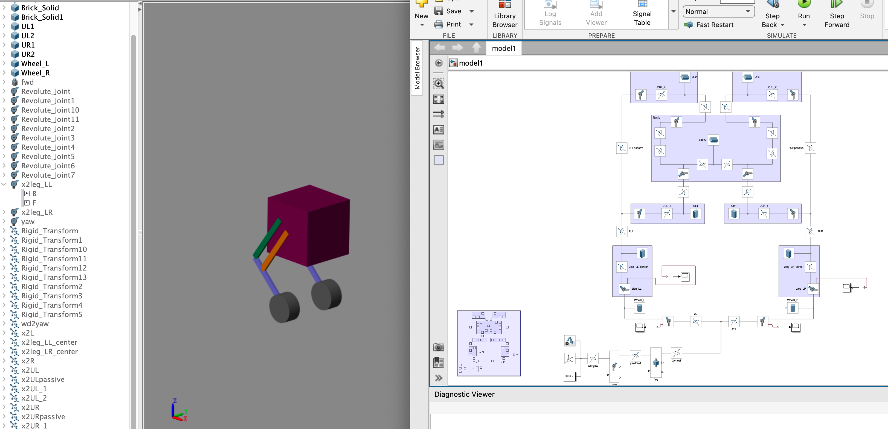

# Wheeled Bipedal
Wheeled bipedal robot for self interest

MATLAB Simscape model.

Since I did not have too many Multibody modelling experience other than inverted pendulum, it's a good chance to try more.

Planning to use <code>grid</code> and relative blocks in the future. Currenly the modelling idea is from [here](https://github.com/roslovets/GMP)